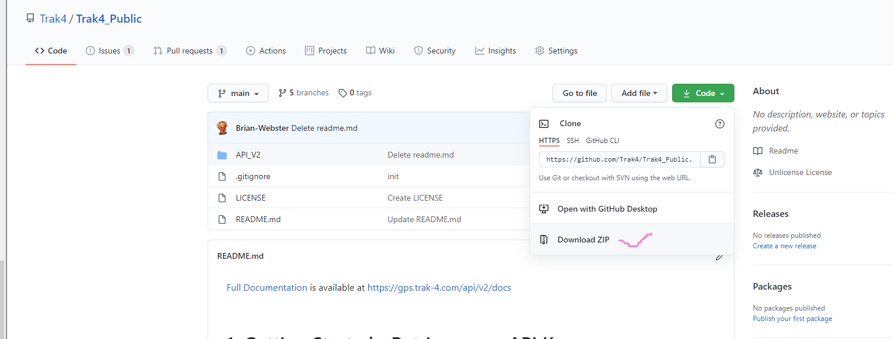
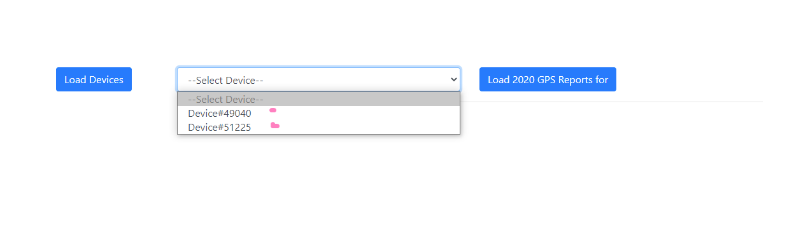

[Full Documentation](https://gps.trak-4.com/api/v2/docs#Section3) is available at https://gps.trak-4.com/api/v2/docs

<br/>

# 1. Getting Started - Retrieve your API Key

- Visit https://gps.trak-4.com/
- Log in
- Click your username in the top right
- Your API key will appear in the account settings panel.

## Reminders

- The API key is rather lengthy. Make sure to copy the entire key!
- Now is a good time to read about API rate limits.

<br />

# 2. API Request - Validate API Key

- Returns a message indicating the validity of the API key.
- This API request is entirely optional. It is a good "getting started" request. 

<br />

- HTTPS Post to **https://gps.trak-4.com/api/v2/ with the following JSON Payload:**
```
{
 "commandstring": "validate_api_key",
 "token": "Insert_My_API_Key"
}
```

<br />                  
			
**JSON Payload Details**
- **commandstring**: String API Request Command
- **token**: Your API Key

<br />

**Sample Response**

```
 {
  "CommandString": "validate_api_key",
  "timestamp": "12/06/2017 11:14:41",
  "message": "Valid API key."
 }
 ```

<br />

# 3. API Commands

- Get Devices
- Get Device
- Get Reports 
- Single Device
- Retrieve Reports
- All Devices
- Get Reporting Frequency Options for Device
- Get Organizations
- Get Device Groups
- Get Device Group Devices
- Set reporting frequency for device

<br />

# 4. [Full Documentation](https://gps.trak-4.com/api/v2/docs#Section3)

<br />

# 5. Steps To Run Typescript_React App

- Clone Project To Your Machine



- Open Project in Power Shell Window (Press shift + right click)


- Enter following commands to run the project:
	- npm install
	
	
	
	- npm start
	
	
	
	- App will run on port 3000:
	
	
	
- Following steps to get the devices and data	

	- Press Load Devices Button
	
	
	
	- Select Device from drop down and press Load 2020 GPS Reports Button To get Data
	
	
	


